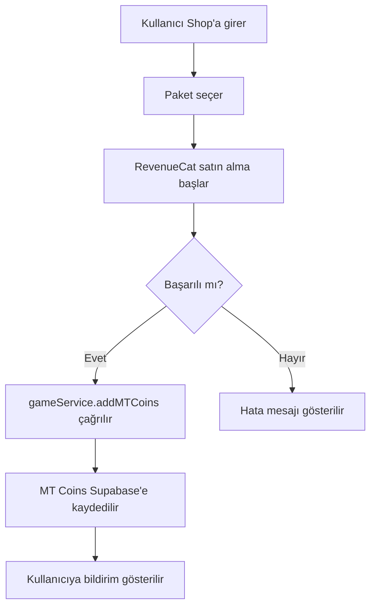

# 💎 MT Coin Sistemi Kurulum Rehberi

## ✅ Tamamlanan İşlemler

### 1. Database (Supabase)
- ✅ `player_stats` tablosuna `mt_coins` alanı eklendi
- ✅ Migration dosyası oluşturuldu: `20250811000004_add_mt_coins.sql`
- ✅ Varsayılan değer: 0 MT Coin

### 2. TypeScript Tipleri
- ✅ `PlayerStats` interface'ine `mtCoins: number` eklendi
- ✅ Tüm gerekli tiplemeler güncellendi

### 3. Game Service
**Yeni Fonksiyonlar:**
- ✅ `addMTCoins(amount, bonus)` - Satın alma sonrası MT ekleme
- ✅ `spendMTCoins(amount, reason)` - MT harcama
- ✅ `saveMTCoinsToSupabase()` - Supabase'e kaydetme
- ✅ `finishBuildingWithMT(businessId)` - İnşaat hızlandırma
- ✅ `finishUpgradeWithMT(businessId)` - Yükseltme hızlandırma

**Güncellenen Fonksiyonlar:**
- ✅ `loadPlayerStatsFromSupabase()` - MT Coins yükleme
- ✅ `getDefaultPlayerStats()` - Varsayılan MT: 0

### 4. Shop Entegrasyonu
- ✅ RevenueCat satın alma işlemi tamamlandı
- ✅ Satın alma başarılı olunca `gameService.addMTCoins()` çağrılıyor
- ✅ Bonus MT hesaplaması eklendi
- ✅ Kullanıcıya bildirim gösterimi

### 5. UI Güncellemeleri

#### Ana Sayfa (`index.tsx`):
- ✅ MT Coin gösterim kartı eklendi
- ✅ 2x2 stats grid yapısı (Para, MT Coin | Enerji, Soldato)

#### İşletmeler (`businesses.tsx`):
- ✅ İnşaat hızlandırma butonu (MT ile)
- ✅ Yükseltme hızlandırma butonu (MT ile)
- ✅ MT Coin maliyet hesaplaması (her 10 dakika = 1 MT)

#### Shop (`shop.tsx`):
- ✅ MT Coin bakiyesi gösterimi
- ✅ Satın alma sonrası otomatik ekleme
- ✅ Bonus MT gösterimi

---

## 📋 Supabase SQL Komutları

### Adım 1: SQL Editor'ü Aç
1. [supabase.com/dashboard](https://supabase.com/dashboard) → Projeniz
2. Sol menü → **SQL Editor**

### Adım 2: MT Coins Alanını Ekle
```sql
-- player_stats tablosuna mt_coins alanı ekle
ALTER TABLE player_stats
ADD COLUMN IF NOT EXISTS mt_coins INTEGER DEFAULT 0 NOT NULL;

-- Mevcut kullanıcılar için varsayılan değer ata
UPDATE player_stats
SET mt_coins = 0
WHERE mt_coins IS NULL;

-- Başarı mesajı
SELECT 'MT Coins field added successfully! ✅' as message;
```

### Adım 3: RUN Butonuna Tıklayın

---

## 💰 MT Coin Kullanım Alanları

### 1. İnşaat Hızlandırma
- **Maliyet:** İnşaat süresi ÷ 10 (dakika başına 1 MT)
- **Örnek:** 120 dakika inşaat = 12 MT Coin
- **Kullanım:** İşletmeler sayfasında "İnşaatı Hızlandır" butonu

### 2. Yükseltme Hızlandırma
- **Maliyet:** Yükseltme süresi ÷ 10 (dakika başına 1 MT)
- **Örnek:** 180 dakika yükseltme = 18 MT Coin
- **Kullanım:** İşletmeler sayfasında "Yükseltmeyi Hızlandır" butonu

### 3. Aile Kurma (Gelecekte)
- **Maliyet:** TBD
- **Kullanım:** Aile oluşturma ekranında

---

## 🛒 MT Coin Satın Alma Paketleri

| Paket | MT Coin | Bonus | Toplam | Fiyat |
|-------|---------|-------|--------|-------|
| Küçük | 100 | 0 | 100 | $0.99 |
| Orta | 500 | 50 | 550 | $4.99 |
| Büyük | 1,200 | 200 | 1,400 | $9.99 |
| XL | 2,500 | 500 | 3,000 | $19.99 |

---

## 🔄 Satın Alma Akışı



---

## 🧪 Test Senaryoları

### 1. MT Coin Satın Alma Testi
```typescript
// Shop sayfasından paket satın al
// Beklenen: MT Coins bakiyesi artmalı
```

### 2. İnşaat Hızlandırma Testi
```typescript
// İşletme inşa et
// "İnşaatı Hızlandır" butonuna tıkla
// Beklenen: MT azalmalı, inşaat tamamlanmalı
```

### 3. Yükseltme Hızlandırma Testi
```typescript
// İşletme yükselt
// "Yükseltmeyi Hızlandır" butonuna tıkla
// Beklenen: MT azalmalı, yükseltme tamamlanmalı
```

### 4. Yetersiz MT Testi
```typescript
// MT'yi sıfırla
// Hızlandırma butonuna tıkla
// Beklenen: "Yetersiz MT Coin!" hatası
```

---

## 📊 Veritabanı Şeması

```sql
player_stats {
  id: uuid (PK)
  username: text
  cash: numeric
  level: integer
  experience: integer
  ...
  mt_coins: integer  -- YENİ ALAN
}
```

---

## 🚀 Sonraki Adımlar

1. ✅ Supabase SQL'i çalıştır
2. ✅ Uygulamayı yeniden başlat: `npx expo start --clear`
3. ✅ Shop'tan test satın alımı yap
4. ✅ MT Coin bakiyesini kontrol et
5. ✅ İnşaat/yükseltme hızlandırmayı test et

---

## ⚠️ Önemli Notlar

1. **RevenueCat Test Modu:**
   - Test satın alımları gerçek para kullanmaz
   - Production'da gerçek ödeme yapılır

2. **MT Coin Güvenliği:**
   - Tüm işlemler Supabase üzerinden doğrulanır
   - Client-side değişiklikler geçersizdir

3. **Hızlandırma Maliyeti:**
   - Her 10 dakika = 1 MT Coin
   - Örnek: 2 saat (120 dk) = 12 MT

4. **Bonus MT:**
   - Sadece belirli paketlerde
   - Otomatik hesaplanır ve eklenir

---

**Başarılar! 💎🚀**
